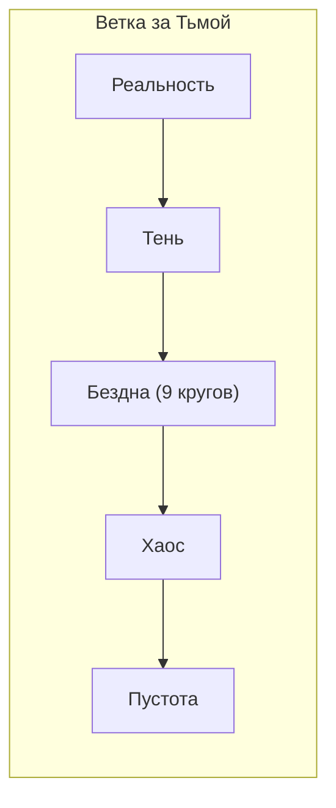
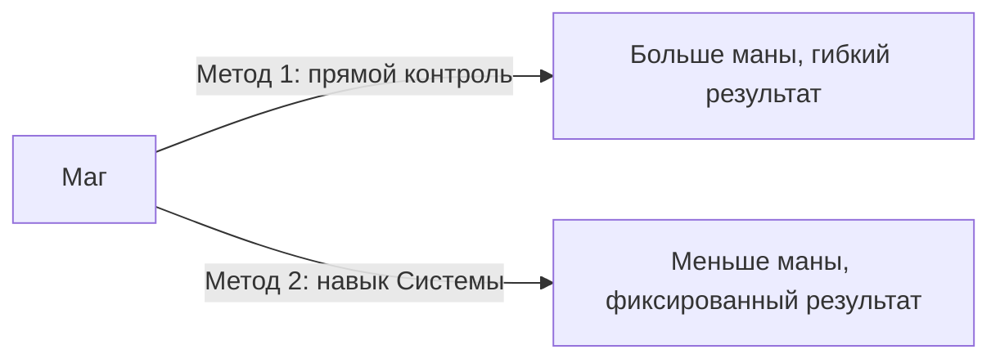

Существует разделение на **[Стихии Порядка]** и **[Запредельные Стихии]**, согласно их влиянию на мир:
- **Стихии Порядка**
> Это базовые стихии, первостихии, формирующие сам Мир - они спокойны и знают свое место в нем
> Сюда относятся естественные первоэлементы: ***[[Вода💧]], [[Воздух☁️]], [[Земля☘]], [[Огонь🔥]], [[Свет☀️]], [[Тьма🌑]]*,** а также ***[[Звезды💫]], [[Разум🧠]], [[Кровь🩸]]*** и некоторые причисляют ***[[Фрактал◈]]*** или ***[[Цвет]]***
- **Запредельные Стихии**
> Это некие чужеродные стихии, каким-либо образом просочившиеся в Подлунные Миры. Они своевольны и агрессивны, стремятся закрепиться в мире различными образами
> До этих сомнительных сил добираются различными способами, к примеру через ритуалы или даже Стихии Порядка
> Таким образом были призваны Силы за Тьмой: ***[[Бездна]], [[Хаос]], [[Пустота]]***
> Примерно также сформировались Силы за Светом: ***[[Изнанка]], [[Астрал]], [[Созидание]]***

![[Атлас стихий.png|620x1041]]
*Базовая версия атласа*

*прим.*
*[[Взаимодействие стихий до слияния.png]] [[Взаимодействие стихий после слияния.png]]*
*Две схемы, показывающее взаимодействие магии более подробно на примере Астрала. Стихии не линейны, каждая из них имеет связь с другой через определённые **аспекты**. Единственные две стихии, которые не имеют пересечений - [[Пустота]] и [[Созидание]].* 

У стихий также существует множество **аспектов** и возможностей влияния на мир, и это поистине огромная тема.
Самое базовое, что стоит знать - у стихий есть специализации. Условно Свет лечит и благословляет а Тьма скрывает и проклинает. Ну и до возможностей бывает сложно дотянуться - у Воды заклинания лечения это обычные 1 круг, когда у Огня это эпические третьего.

> Ну и если затрагивать тему исцеления - лучше в этом деле 3 стихии, это Свет, Вода и Земля(*аспект Природы*)

В Подлунных Мирах ты не управляешь куском металла, ты управляешь частью себя. Потому и нужна накачка маной - вначале ты напитываешь нечто своей энергией, после чего уже можешь управлять этим... в рамках своих возможностей.

Фрактал стоит над всем, на нём держится Система.
За законы физики изнутри отвечает Магия Звёзд. А фрактал - тоже за законы мира, но извне, как обеспечивающая работу Системы

Есть два типа колдовства стихий
1) Прямое создание вещества из Маны.
2) Наполнение своей маной реального вещества

Может ли маг вложить свою ману в не профильный для него объект? Например, маг воды в камень? Если умеет то может. В первую очередь это навык контроля... ну и от стихии тоже зависит. Вложить ману воды в огонь это надо быть гением (или иметь их гибридный источник)

---
### Про запредельные стихии
Запредельные стихии, это некие концепции, которым нет места в мире - они ведомы своей волей и логикой, влияя на последователей и мир вокруг. Их делят на два типа, "за светом" и "за тьмой", на +/- 123 согласно их порядку и способу открытия.

Чем дальше от Тьмы/ Света, тем более глобальные и сложные (*как в плане познания человеком так и космологически*) концепции они олицетворяют. 

Иными словами, можно все представить таким образом: Сначала реальность, под ней **Тень**, затем можно спускаться в **Бездну**, если пройти её всю, то за девятью кругами начинается **Хаос**, где пропадают законы физики, логики и здравого смысла, а где-то за границами хаоса лежит **Пустота**...
> Ну и со светом похожая ситуации, но в отличии от Стихий за Тьмой, эти силы не стремятся попасть в реальность, из-за чего к ни необходимо добираться самим... Можно сказать что Свет слепит в глаза и тяжело идти)
> Сначала реальность, над ней зыбкий план мечтаний, **Изнанка**, затем выше **Астрал** - как Изнанка, но не этого мира, а других... ну и дальше Астрала никто не попадал.

Уровень стихии типа +3/-3 это про расстояние от мира повествования, а не силу, хоть и не без этого.

---

Про запредельные стихии Тьмы, можно выделять следующие, про их влияние на душу и вообще сущность пользователя:
- Бездна загрязняет
- Хаос искажает
- Пустота отбирает

Это деление условное, чисто для символизма. Ведь все бывает разным
> Ветка за тьмой - искажение.
> Ветка за светом - потакание. Чему? Фантазиям, мечтаниям...

> [!Про Запредельные стихии за Тьмой]
> Каждая из нижних стихий по-своему позволяет сократить разрыв в уровнях с сильным противником. Пустотник разрывает свою душу на части, обретая могущество ценой безумия. Демонологи могут призывать сильных союзников, что встанут на их сторону в битве. Хаос же… невозможно уничтожить. Хаос найдет способ выжить и преумножить себя.
> 
> Бездна потребует твою душу. Хаос потребует душу и плоть. Пустота же выпьет все без остатка, лениво поглядывая в сторону.
> 
> Взамен они, возможно, поделятся с тобой частицей своей силы. Демоны готовы открыть тебе многие тайны. Хаос приоткроет окошко к своим, но лишь самую малость. Его родной мир находится намного дальше и глубже, чем бездна.
> 
> Пустота же находится еще дальше. Если великий Хаос кажется нам непонятным и чуждым, если его мировосприятие за пределами вашего понимания, то что можно сказать о Пустоте, что находится еще глубже во мраке?
> 
> Возможно, на самом его дне.
> 
> Пустота абсолютно не понятна никому в этом мире. Ни смертным, ни богам, ни великим волшебникам. Она приоткрывает ничтожную крупицу себя, но этого уже достаточно, чтобы свести с ума так, как не способен некогда единолично властвовавший в аспекте безумия Хаос.
> 
> Когда из нижних миров явилась новая темная стихия, все прежние быстро нашли общий язык и заключили союз против общего врага. А ведь ранее все таже дружно объединились перед угрозой Хаоса, но нынче, вместе с ним же, всталли по одну сторону напротив Пустоты....
> 
> Что такое вражда стихий? Это когда сила видит то, что ей враждебно, и атакует. Всего пара капель – и все, заражения хаоса нет, а ты – пустотник. Поэтому любые эксперименты и любое взаимодействие с Пустотой – приговор для экспериментатора. В итоге всегда остается лишь крошечная песчинка личности в безбрежном океане отчаянья.

...

Также существует явление [[Гибридные Стихии]], что совмещают в себе сильные стороны конкретных стихий, из которых они состоят, порождая нечто новое.

Обычно действует одно простое правило: стихия наносит пониженный урон по самой себе... но с Пустотой оно не работает - она урон по себе умножает.

**Как получить стихию противоположность?**
Чтобы получить новую стихию из ничего есть разные способы. Один из них - путь истинной противоположности. Опуская подробности, необходимо очистить стихию и сконцентрировать настолько, чтобы законы мироздания были нарушены, и часть силы переродилась противосилой.

---
### Способ развития сил
В человеке изначально есть и аура, и чакры, и прочие штуки.
Изначально уже всё есть... просто может быть не развито или не работать.
Тут уже развивать эту нужно.

**Маги** напрямую развивают магическую структуру. Учат заклинания и развивают источник внутри. Это намного быстрее но развивает лишь источник, пассивно. И учат контролировать ману вокруг себя.
**Культиваторы** запариваются чакрами. Они учатся намного дольше и сложнее, и не учат заклинания, но могут управлять маной внутри своего тела, меняя физические возможности организма.

Сочетать можно, если что. Это просто разный подход.

Ауру развивать особо не надо - это следствие того что есть. Она как бы излучение. 
Ещё *точка сборки* (*восприятие вне тела*) есть, но это больше для шаманов, там своё

Потенциально, ЛЮБОЙ разумный и не очень может развивать все системы разом... но есть подводные камни:
> Развивать ВСЕ системы - задолбешься. В Стене - вставить неимоверно много модов. Вне стены - культивировать многие десятки и сотни лет. Хотя конечно крутые маги которым сотни лет именно это и делают.
> Ну и запредельные стихии так не развиваются, там свои правила.

Важный моментик. Касательно Культиваторов.
Хоть для наращивания силы этим путем требуется крайне много времени и ресурсов, кажется что это бесполезно в ряде миров вроде [[Устройство Города |Города]] или [[Стена|Стены]], ведь там нет столько времени и частые смерти и люди начинают сначала... но нет - каждое начало пути увеличивает потенциал и талант для будущих свершений в культивации. Иными словами тут накопительный эффект – чем дольше культивируешь в одной жизни, тем легче начать в другой и выше будут результаты.

---
### По источникам стандартных стихий и откуда магия без источника
Стандартные стихии (*не запредельные*) завязаны на расовые возможности. Жители мира так или иначе пропускают через себя разного рода энергии и каждое тело с эзотерической точки зрения состоит из всех элементов в разном сочетании.
Народ Триантари, к примеру, вообще верили что каждое живое существо можно описать шестью стихиями с процентном соотношении, как индивидуальный код или магический отпечаток.

Если начать практиковать магию, источник быстро развивается (*в зависимости от параметра "могущества" но его вряд-ли его кто-то нормально измерит или повысит*). Это условно талант новичка. 
Чем больше пользуешься - тем больше эта сила становится доминирующей и отодвигает потенциал других источников.
Вторую стихию учить уже сложнее. Третью - ещё сложнее и так далее. Просто - что колдуешь в том и продвигаешься. По этой же причине на мага так сильно влияют его стихии.

С запредельными так не работает, потому что их и нет - они в других мирах обитают. К ним талант никак не зависит от стандартных стихий, они завязаны на другое и конфликтуют друг с другом.
Они развиваются по правилам своего плана. Эти правила сложно реализовать в других планах, поэтому как такого быстрого развития то и нет... Хотя некоторые моменты можно и реализовать, например Гаввах от Пустоты - страдание личное или чужое, что повышает силу.

Источник запредельной стихии - большая редкость в обычном мире, и есть только у специфических рас, которые с ними породнены. Но представитель любой расы может получить стихию, заключив контракт с сущностями оттуда. Такая связь не будет изменяться через ритуалы смены расы, даже если есть несовместимость с этой новой расой. Потому как она(*связь с запредельной сущность и источник*) и не в теле, а через контракт/артефакт/руны итд.

---
### Антимагия

Антимагия не стихия а свойство. Оно может проявляться по разному.
У Ханатри есть самое близкое к понятию источника антимагии. Но в целом это не какая-то особая одна сила, а набор свойств или техник работы с маной.
Красный свет ионитов - вообще не антимагия. Побочное свойство его работы что под ним магии не существвует. Если свет убрать - она опять появится будто и не исчезала. Он не развеивает её, а просто игнорирует.

Техники антимагии не привязаны к стихии, они связаны с навыками контроля маны в целом.
Конкретно по стихиям есть свои фишки, но это уже конкретные навыки конкретных стихий.
**Звёзды** да, лучше всего могут быть антимагией, нарушая законы её работы. **Разум** может быть антимагией для воздействия на разум. **Фрактал** - для физических воздействий. Магией крови **очень** хорошо можно разрушать ритуалистику. Но в случае конкретных стихий это не будет универсальным приёмом, а под конкретный список задач. К примеру в той же магии **воды** с первого ранга доступны базовые заклинания очищения, снимающие проклятия и дебафы. Это тоже своего рода антимагия, хотя на деле просто мана с водой отмывает ауру от лишнего, там чары не разрушаются даже, а смываются как грязь. **Свет** отлично чистит тёмные влияния. У **тьмы** есть такая же способность против магии света. Но это скорее целевые влияния, а не разрушение чар... Тема, как всегда обширная и ее можно долго изучать.

---
### Применения Магии
Применять магию возможно лишь при наличии соответствующего Магического Источника. Такие вещи могут быть как биологическими, вроде особых желез и органов, так и чем-то нематериальным, вроде чакр в ауре или структур в душе.

Для применения магии необходимо насыщать цель своей маной и энергией - это главный принцип. 
> Ты управляешь не просто лужицей - ты управляешь частью себя. Только когда лужа будет с твоей маной, только тогда она начнет тебе подчиняться, потому что станет продолжением тебя. И только тогда можно будет управлять ею и использовать в своих целях... если, конечно, хватит контроля. Ведь может быть так, что в объекте, что ты хочешь контролировать, много примесей... например в луже много грязи ли там вообще кислота. Ее все равно можно контролировать, хоть и с нюансами, в виде способа контроля - то есть ты ведь не просто насыщаешь лужу своей энергией, ты пропиваешь энергией лишь ее часть что можешь контролировать, то есть воду и вот уже за счет нее можно влиять на всю лужу... Сложно? На самом деле принцип простой, и из этого примера просто следует знать, что для контроля чего-то следует это что-то насыщать своей энергией, и иногда даже тратить на это куда больше энергии чем нужно, ведь "примеси" могут мешать.

Сами магические источники бывают следующими.

| Размер                      | Возможности                                                   | Объем                         |
| --------------------------- | ------------------------------------------------------------- | ----------------------------- |
| Ничтожный                   | Слабое и примитивное проявление магии для обслуживания скилов | до 10 ед                      |
| Очень слабый                | Целевой источник, обслуживающий конкретный навык              | от 10 до 100 ед               |
| Слабый                      | Магия 1 ранга                                                 | до 1000 ед                    |
| Ниже среднего               | Ограниченные способности 2 ранга                              | до 5000 ед                    |
| Средний                     | Магия 2 ранга                                                 | до 15 000 ед                  |
| Выше среднего               | Ограниченные способности 3 ранга                              | до 25 000 ед                  |
| Сильный                     | Ограниченные глобальными эффектами способности 3 ранга        | до 50 000 ед                  |
| Очень сильный               | Магия 3 ранга                                                 | до 100 000 ед                 |
| Огромный                    | Некоторые способности 4 ранга                                 | до 500 000 ед                 |
| Великий                     | Магия 4 ранга                                                 | до 1 000 000 ед               |
| Полубожественный            | 1 ограниченная способность 5 ранга                            | от 1 000 000 до 10 000 000 ед |
| Божественный/Трансцендентый | Магия 5 ранга                                                 | до 100 000 000 ед             |
| Старшее божество            | От 1 до 2 способностей 6 ранга                                | до 1 000 000 000 ед           |
| Демиург                     | Магия 6 ранга                                                 | неизвестно                    |

Связь Источника с конкретной стихией измеряется в процентах, где каждые 100% - новый ранг:

| Ранг |   Название    |
| :--: | :-----------: |
|  1   | Синхронизация |
|  2   |  Сопряжение   |
|  3   |   Единение    |
|  4   |  Растворение  |
|  5   |  Воплощение   |
###### 
Круги Магии

|  Ранги Магии   | Описание                                                                                                             |
| :------------: | -------------------------------------------------------------------------------------------------------------------- |
|   Первый (l)   | Уровень базовых заклинаний                                                                                           |
|  Второй (ll)   | Уровень опытного мага, он же "средний"                                                                               |
|  Третий (lll)  | Уровень сильного мага                                                                                                |
| Четвертый (lV) | Уровень очень сильного мага, способного глобально влиять на континенты                                               |
|   Пятый (V)    | Уровень богов и высших сущностей, способный влиять на весь мир. О таком стараются не говорить...                     |
|  Шестой (Vl)   | Такое во вселенной случалось всего пару раз... Вряд-ли встретится где-то кроме полузабытой легенды безумного народа) |
###### 
Виды урона и воздействия

![[Виды урона и воздействия.png|549x499]]

Поскольку когда-то Подлунные Миры были игрой (*или это просто влияние Фрактала и Системы*), то помимо базового использования магии, есть и другой, более простой способ... использовать Систему и ее навыки.

Пусть будет два объяснения:
- Первый, классический. Маг выплескивает ману в озеро и насколько ее хватит, столько он и заберет воды.
- Второй, игровой. Маг применяет навык через систему(*а у нас РеалРПГ, напоминаю*) и система считает, забирает маны сколько нужно и дает результат который прописан.

И что интересно, контроль(*метод 1*) забирает куда больше маны, чем просто каст через Систему... что логично, ведь ты "отбрасываешь ее костыли". Они лаконичные, отточенные, но жесткие.

---
###### Естественный защитный механизм
Почему условный маг воды не может взять под контроль влагу внутри тела человека и убить его таким образом?
Все дело в существовании некого естественного защитного организма... Есть естественная аура и энергетические тела. Это причина, почему невозможно применять магию внутри чужого тела. Маг воды не может вскипятить противника изнутри, потому что энергетические тела не позволят чужеродной магии проникнуть в тело. Для этого маг должен превосходить свою жертву как человек насекомое.

Каждое существо, в той или иной степени имеет внутри ману или прочую энергию, что входит в конфликт и защищает т чуждого влияния... словно магический иммунитет, если говорить совсем уж грубыми словами.

##### Вида магических источников
- **Фазовый источник** - источник со свойством переключения, позволяет менять режим источника
- **Сопряжение** - структура из излучателя и накопителей, нестабильная, но быстро качает ману
- **Соборный** - множество осколков в теле, работают в симбиозе и генерируют ману, такую структуру сложно полностью уничтожить
- **Эфемерный** - появляется при активации определенного навыка, все остальное время не существует
- **Теневой** - встраивается в теневую структуру другого источника, заставляя этот источник симулировать существование второго

Еще есть **гибридные** источники и **фантомные** источники, но с ними все сложнее. 
Первые дают доступ к двум стихиям и [[Гибридные Стихии|гибридной стихие]], а фантомные вообще что-то непонятное, в теории это особые структуры, усиливающие работу других источников, но в этом вопросе все шито белыми нитками