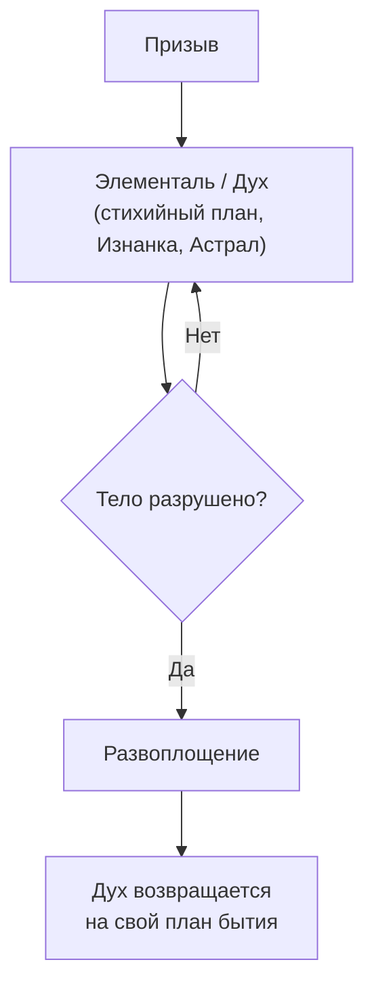
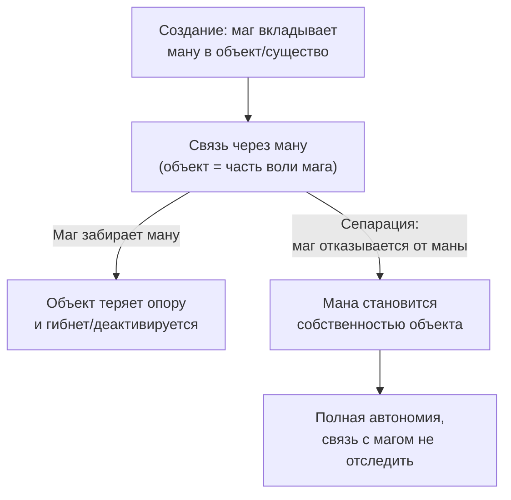

Это школа маги, доступная различным стихиям - призыв и воплощение различных существ с иных планов бытия. 
Самое базовое - призыв элементалей со стихийных планов, или духов с Изнанки или Астрала. Также существуют даже специальные заклинания, мгновенно убивающие исключительно саммон. Или изгоняющие его на свой план бытия.

Главный подвох в том, что нельзя в полной мере "убить" саммон. Когда тело призванного существа становится разрушенным с его точки зрения, оно просто развоплощается, а дух существа уходит обратно в свой мир.  
То, что возникло из ниоткуда - то в никуда и вернётся.

---
Если кратко, то Сепарация - навык отделения, в основном саммона и призыва, от заклинателя, делая тот самостоятельным, и отсекая возможность проследить через заклинание за сотворившим.

Например Друид создал растение: он не связан с этим растением корневой системой, зачем ему нужна сепарация? Друид чувствует растения вокруг себя против его воли? 
На самом деле он связан маной со своим призывом.
У каждого саммонера есть такая связь. Некромант связан с нежитью, Призыватель астральных собачек - имеет связь с ними. 

Связь нужна чтобы призыв не взбунтовался и не откусил голову хозяину. Он как продолжение его воли с разной степенью автономии. Сепарация эту связь разрывает.

Порой так, например Друиды, из своей маны создают растения для определенных целей, а потом может вытянуть ману (*если не использовал сепарацию*). И ненароком высушить растение - ведь у того нет свой маны, только та из которой она создана. Сепарация предполагает не забирать ману, а отказаться от неё. То есть мана Друида становится маной растения.

То есть растения, созданные из маны не могут без неë житью, но могут ею делиться, когда наработают свою.
Растения свободолюбивые, могут сами выйти из под контроля мага(*Сепарироваться самовольно*), если не имеют долгого контакта с ним (*да и со всеми так, только срок разный*)
Так что можно вместо сепарации просто игнорировать создание и однажды оно станет самостоятельным само по себе. Или накормить его чужой маной.

А растения без маны не могут жить? Разве человеку нужна мана для поддержания жизни?
Обычные растения могут, но они не за один день вырастают, а собирают ману из солнышка, из земли, воздуха итд естественным путём. А друиды накачивает лошадиными дозами. Потому если забрать эту ману, растение погибнет. 
С нежитью наверное наглядней. Вкинул ману некромант в труп, поднял зомби. Если он свою ману заберёт - зомби снова станет просто телом. Но есть ведь зомби которые живут за счёт например проклятия на кладбище или чего-то такого.
Для человека так же, нужна. И она есть у каждого своя. Даже у обычного человека без магических навыков, просто её меньше. Она же помогает например защититься от того чтобы любой маг воды вскипятил кровь и так далее - она как естественное сопротивление работает.

Сама мана или ее подобие есть везде, в любом объекте или явлении. 
Если призыв не может существовать автономно - будет зависеть от мага, а если условия подходящие, может и сепарироваться

